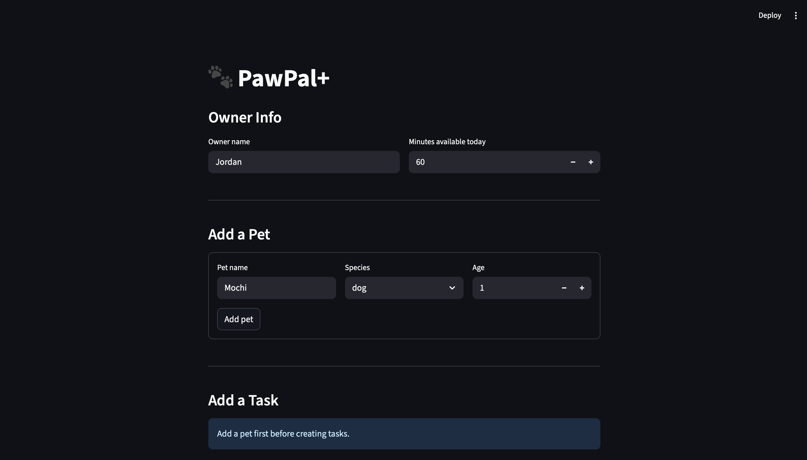

# PawPal+ (Module 2 Project)

**PawPal+** is a Streamlit app that helps a busy pet owner plan daily care tasks for one or more pets. It takes the owner's available time, each pet's task list, and each task's priority and frequency, and produces a smart daily schedule with plain-language reasoning.

---

## 📸 Demo


---

## ✨ Features

### Owner & Multi-Pet Management
- Register an owner with a daily time budget and optional preferences
- Add any number of pets (name, species, age), each with their own independent task list
- All data persists across Streamlit reruns using `st.session_state`

### Task Management
- Add tasks with title, duration, priority (`low` / `medium` / `high`), category, frequency, and an optional preferred start time (`HH:MM`)
- Tasks are stored directly on each `Pet` object — no global task list to keep in sync

### Frequency-Aware Scheduling
- `Scheduler.build_plan()` sorts all pending tasks using a three-key rule: **frequency first** (`daily` → `weekly` → `as-needed`), then **priority** (`high` → `low`), then **duration** (shortest first as a tiebreaker)
- A daily medication is always considered before a weekly grooming session, no matter the order tasks were entered
- Tasks are greedily selected until the owner's time budget is filled; anything that doesn't fit lands in the skipped list

### Sorting by Time
- `Scheduler.sort_by_time()` orders the scheduled plan chronologically by `HH:MM` start time
- Zero-padded strings sort lexicographically — no date-parsing overhead
- Tasks with no start time automatically sort to the end of the plan

### Filtering
- `Scheduler.filter_scheduled()` accepts any combination of `pet_name`, `completed`, and `category`
- Filters stack — e.g., "show only incomplete feed tasks for Mochi"
- Live filter dropdowns in the UI apply instantly without rebuilding the plan

### Conflict Detection
`Scheduler.detect_conflicts()` returns plain-language warnings (never crashes the program) for three conditions:
- **Duplicate task titles** — same incomplete task entered twice for one pet
- **Time overload** — daily tasks alone exceed the owner's available minutes (`st.error` in the UI)
- **Overlapping time windows** — any two scheduled tasks whose intervals intersect (`start_A < end_B and start_B < end_A`), flagged with `st.warning` in the UI

### Automatic Recurring Tasks
- `Pet.complete_task(title)` marks a task done and immediately appends the next occurrence to the pet's task list
- Daily tasks recur the next day (`timedelta(days=1)`)
- Weekly tasks recur in seven days (`timedelta(days=7)`)
- As-needed tasks do not recur

---

## 🧪 Testing PawPal+

### Run the tests

```bash
python -m pytest
# verbose output
python -m pytest -v
```

### What the tests cover

The suite in `tests/test_pawpal.py` contains **21 tests** across six areas:

| Area | Tests | What is verified |
|---|---|---|
| Task basics | 2 | `mark_complete()` flips status; `add_task()` increments count |
| Scheduler — happy paths | 5 | Budget respected; daily before weekly; high before low priority; exact budget fill; over-budget task skipped |
| Scheduler — edge cases | 3 | Pet with no tasks; owner with no pets; all tasks already completed |
| Recurring tasks | 5 | Daily recurs tomorrow; weekly recurs +7 days; as-needed returns `None`; `complete_task()` appends next occurrence; as-needed does not append |
| Conflict detection | 4 | Same start time flagged; overlapping window flagged; touching boundary not flagged; duplicate title warned |
| Sorting | 2 | `sort_by_time()` returns chronological order; tasks without a time sort last |

### Confidence level

⭐⭐⭐⭐ (4/5)

Core scheduling logic — budget enforcement, priority/frequency ordering, recurrence, and conflict detection — is thoroughly covered including targeted edge cases. Remaining gap: UI integration and multi-pet filter combinations are tested manually but not yet in the automated suite.

---

## 🗂 Project Structure

```
pawpal_system.py   # All backend logic — Task, Pet, Owner, Scheduler
app.py             # Streamlit UI
main.py            # Terminal demo / manual testing ground
tests/
  test_pawpal.py   # Automated pytest suite (21 tests)
uml_final.md       # Final Mermaid.js class diagram
uml_diagram.md     # Original draft UML
reflection.md      # Design decisions and tradeoffs
```

---

## 🚀 Getting Started

```bash
python -m venv .venv
source .venv/bin/activate   # Windows: .venv\Scripts\activate
pip install -r requirements.txt
streamlit run app.py
```
