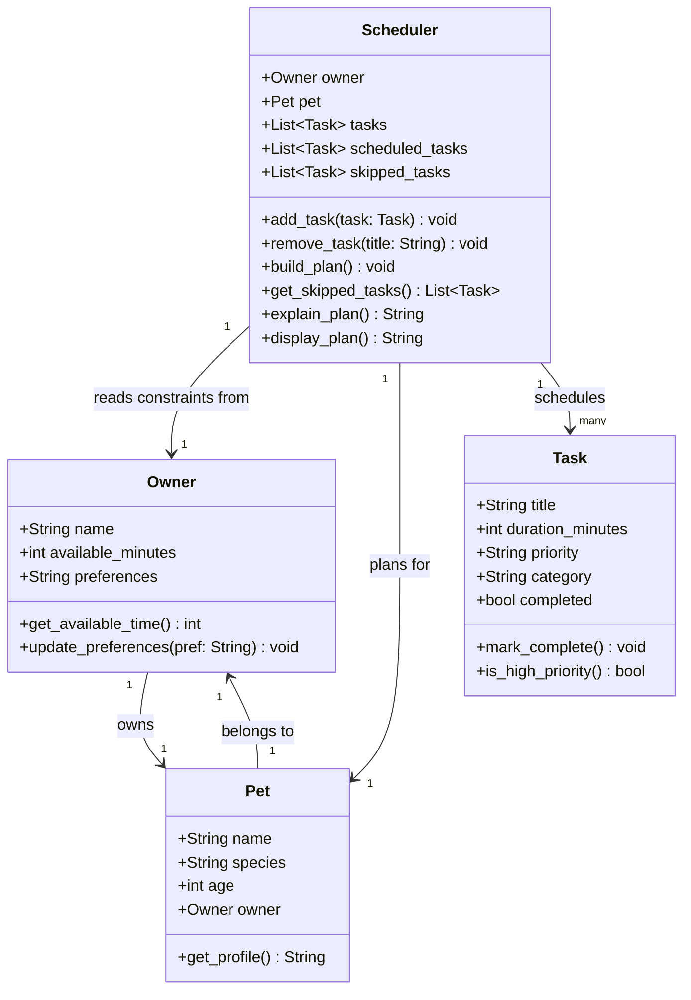

# PawPal+ UML Class Diagram

```mermaid
classDiagram
    class Owner {
        +String name
        +int available_minutes
        +String preferences
        +get_available_time() int
        +update_preferences(pref: String) void
    }

    class Pet {
        +String name
        +String species
        +int age
        +Owner owner
        +get_profile() String
    }

    class Task {
        +String title
        +int duration_minutes
        +String priority
        +String category
        +bool completed
        +mark_complete() void
        +is_high_priority() bool
    }

    class Scheduler {
        +Owner owner
        +Pet pet
        +List~Task~ tasks
        +List~Task~ scheduled_tasks
        +List~Task~ skipped_tasks
        +add_task(task: Task) void
        +remove_task(title: String) void
        +build_plan() void
        +get_skipped_tasks() List~Task~
        +explain_plan() String
        +display_plan() String
    }

    Owner "1" --> "1" Pet : owns
    Pet "1" --> "1" Owner : belongs to
    Scheduler "1" --> "1" Owner : reads constraints from
    Scheduler "1" --> "1" Pet : plans for
    Scheduler "1" --> "many" Task : schedules
```
