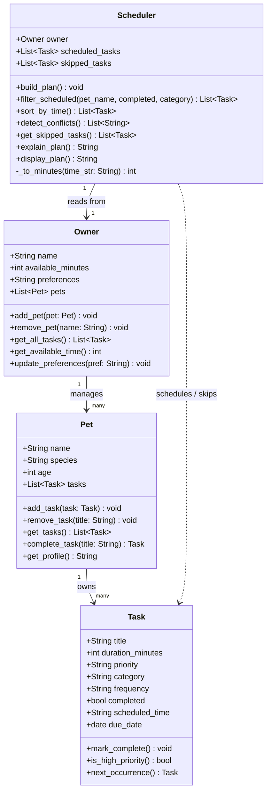

# PawPal+ Final UML Class Diagram

## What changed from the initial design

| Class | Change | Why |
|---|---|---|
| `Task` | Added `frequency`, `scheduled_time`, `due_date`, `next_occurrence()` | Needed for recurring task logic and time-based sorting/conflict detection |
| `Pet` | Removed `owner` back-reference; added `tasks` list and task management methods; added `complete_task()` | Owner → Pet is sufficient; Pet needed to own its tasks directly to support recurrence |
| `Owner` | Added `pets` list and aggregation method `get_all_tasks()` | Owner manages multiple pets; Scheduler retrieves all tasks through Owner |
| `Scheduler` | Removed single `pet` and `tasks` references; added `filter_scheduled`, `sort_by_time`, `detect_conflicts` | Scheduler now works across all pets via Owner; algorithmic methods added in Phase 3 |

## How to export as PNG

Open [https://mermaid.live](https://mermaid.live), paste the diagram code above, and use **Export → PNG**.
Alternatively, use the VS Code **Markdown Preview Mermaid Support** extension to render and screenshot.
